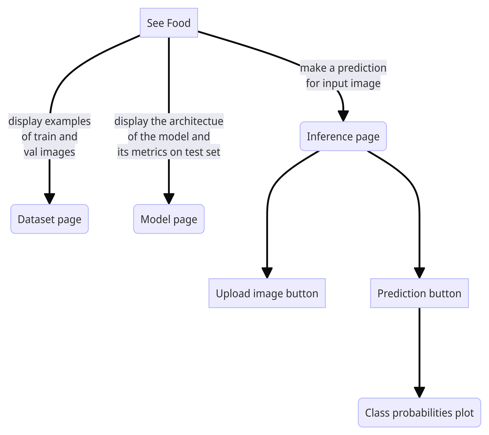

# SeeFood

# Постановка решаемой задачи

Решаем задачу классификации конфет на малых данных. В качестве модели используем
сверточную архитектуру. Данные собираем сами, не храним в репозитории, загружаем
каждый раз с удаленного хранилища(Google drive / S3). После каждого создания
релиза(после прохождения тестов pytest), в случае обновления архитектуры и/или
обновления данных, запускаем обучение с выводом качества **новой** модели в
соответствующем pull-request'е. После успешного выполнения автоматического
обучения модели, ее артефакт(сжатые данные/веса/скрипт) загружается на
выделенный сервер grad.io для тестирования применения.

# Описание предполагаемых инструментов решения

1. Проверка стиля программы:
   - [pre-commit ci/cd](https://github.com/apps/pre-commit-ci)
2. Проверка функционала программы:
   - pytest
3. Автоматическое обучение модели после обновления:
   - [CML](https://cml.dev/) + [DVC](https://dvc.org/doc/api-reference)
4. Фреймворк обучения:
   - [Pytorch Lightning](https://lightning.ai/docs/pytorch/stable/)
5. Применение модели:
   - [Gradio](https://www.gradio.app/)

# Драфт Интерфейса на GRADIO

